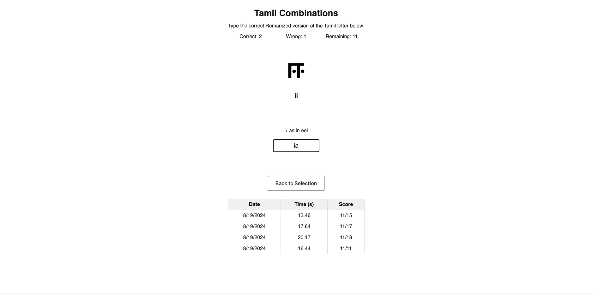
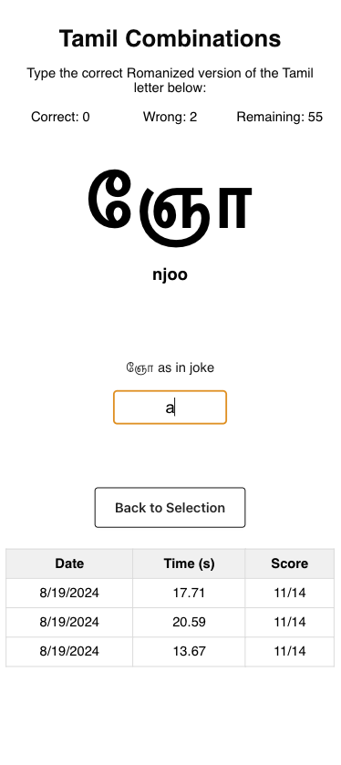

# Tamil Alphabet Game

An interactive game to learn and practice the Tamil alphabet.

## Screenshots

### Home Screen

Desktop View:

Mobile View:

### Game Screen

Desktop View:

Mobile View:

## QR Code

Here is the QR code for quickly accessing the game:

### Progressive Web App (PWA)

Users can install the game on their devices and use it offline:

- **Android**: Open in Chrome > Menu > "Add to Home screen."
- **iOS**: Open in Safari > Share button > "Add to Home Screen."

## License

This project is licensed under the MIT License - see the LICENSE file for details.
